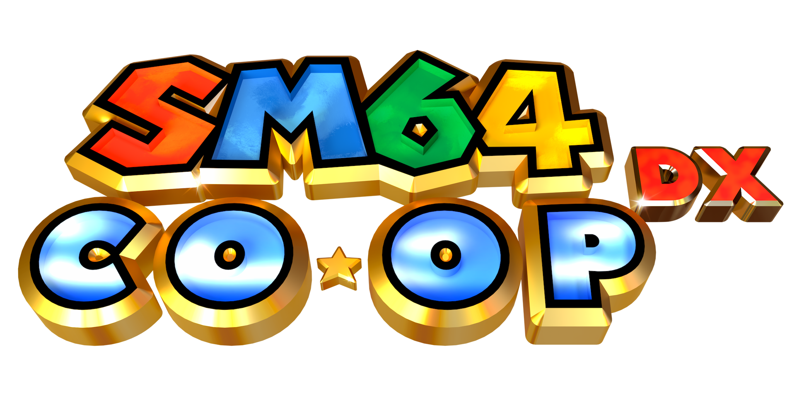

sm64dx is an offline-first singleplayer fork of the Super Mario 64 PC port. It keeps the Lua modding workflow, custom character support, and moddable front end from the coop lineage, but removes the online-first flow in favor of a cleaner local experience.

Feel free to report bugs or contribute to the project. 

## Project Goal
Create a moddable singleplayer build of Super Mario 64 that is easy to launch, recover, and customize locally.

SM64 DX is aimed at local play. It includes first-run setup, accessibility presets, safe-mode startup after unclean exits, and reusable mod profiles for testing different character or gameplay sets.

The Lua API and mod support remain a major focus so existing content can be adapted to the offline flow.

## Lua
sm64dx is moddable via Lua, similar to Roblox and Garry's Mod's Lua APIs. To get started, click [here](docs/lua/lua.md) to see the Lua documentation.

## Wiki
Document local setup, mod compatibility notes, and release information in your own project wiki or docs.
